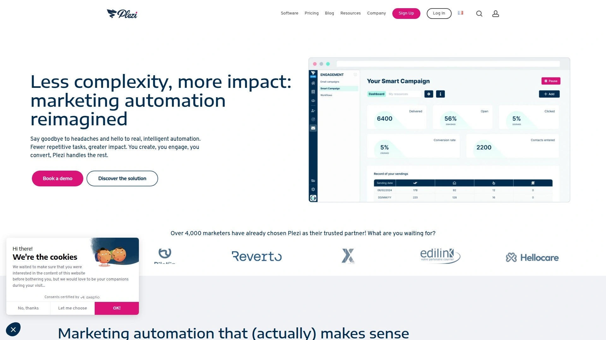
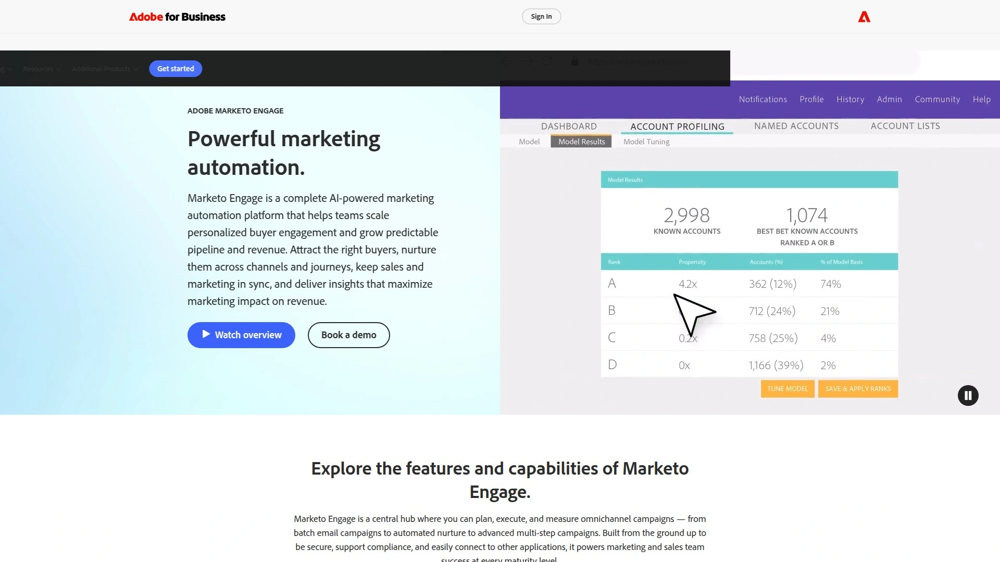
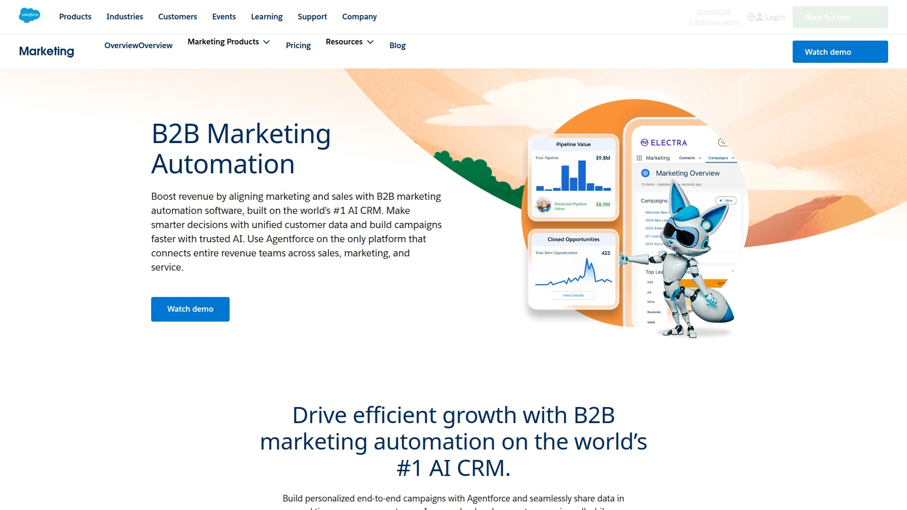
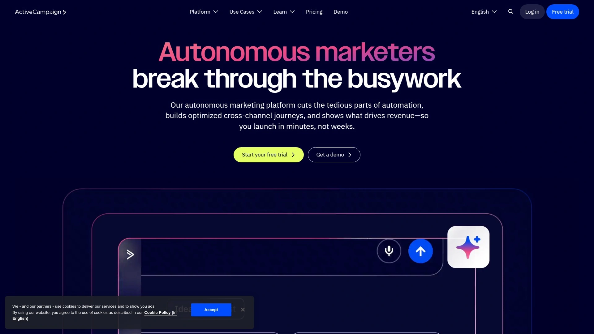
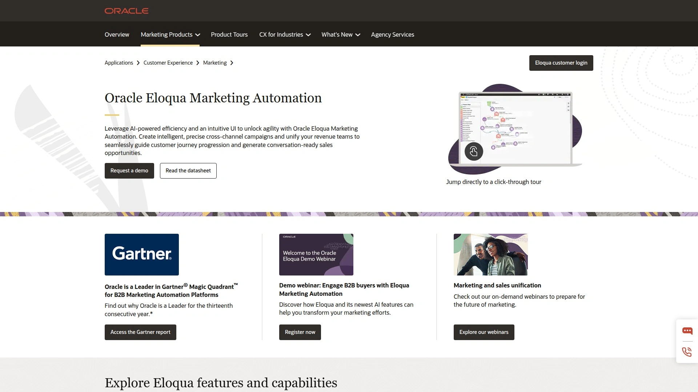
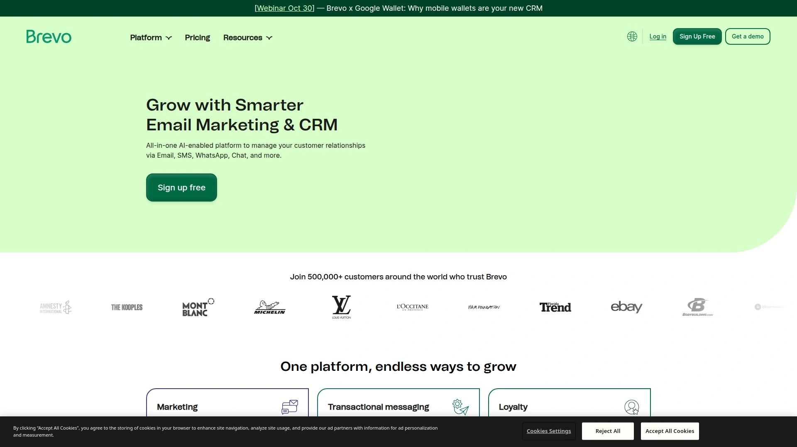
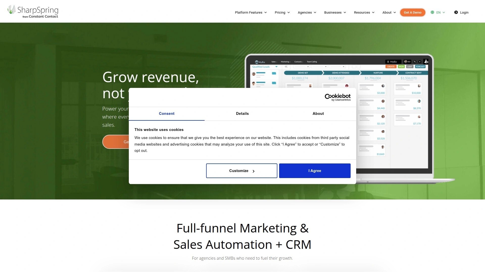
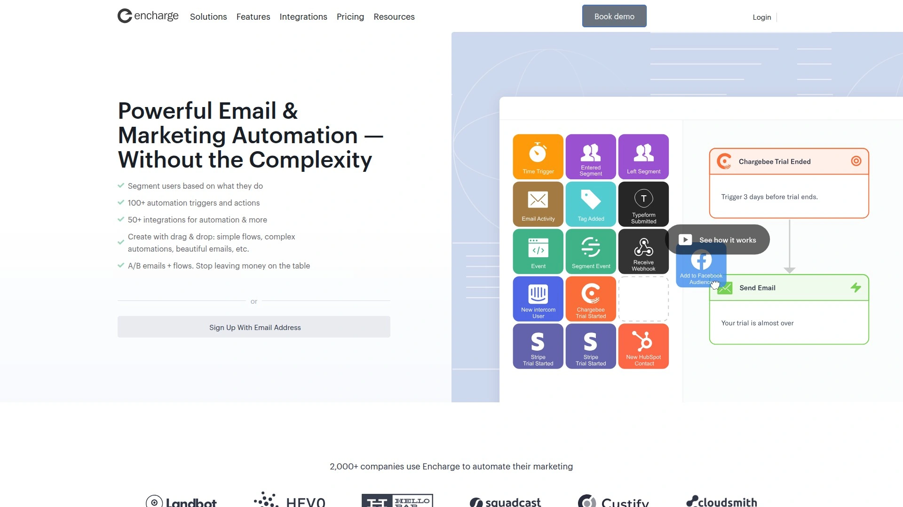
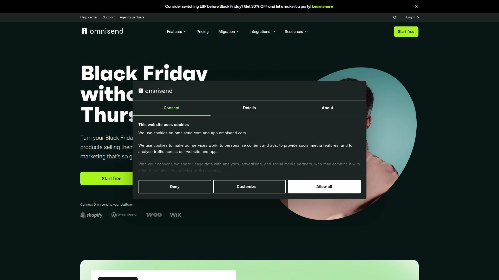
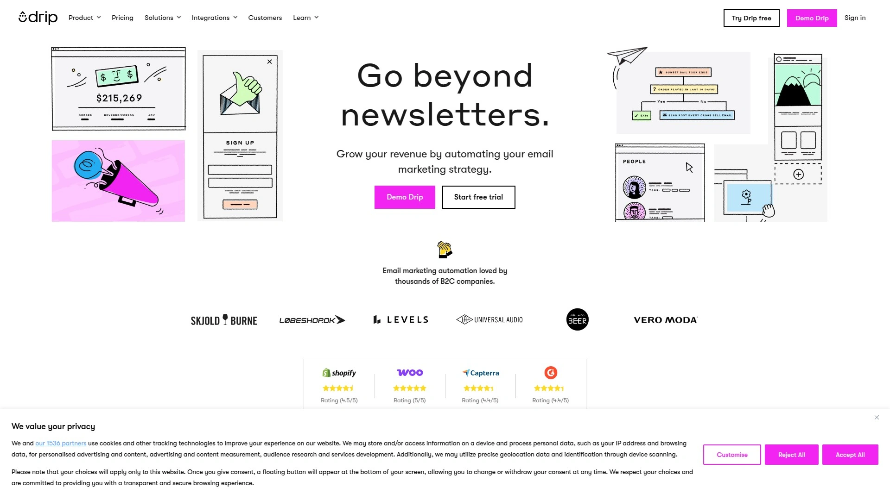

# 2025's Top 11 Best B2B Marketing Automation Platforms

Running a B2B marketing operation without automation feels like rowing across an ocean with a teaspoon. You're manually sending emails, tracking leads in spreadsheets, and losing prospects because follow-ups slip through the cracks. Marketing automation platforms transform this chaos into streamlined workflows that nurture leads intelligently, score engagement automatically, and sync seamlessly with your CRM so sales teams receive qualified prospects with complete behavioral history.

***

## **[Plezi](https://www.plezi.co/en/)**

Intelligent B2B automation that actually makes sense.

Plezi serves over 4,000 marketers with genuinely intelligent automation designed specifically for SMEs across IT, consulting, healthcare, business services, and dozens of other B2B industries. The platform's philosophy centers on eliminating complexity while maximizing efficiency—you create, you engage, you convert, while Plezi handles the repetitive automation tasks that drain marketing teams.

The standout **Smart Campaign** feature transforms lead nurturing into a quasi-independent, highly personalized operation through advanced algorithms that automatically design tailor-made workflows for each content piece based on prospect interactions and preferences. Campaigns adjust dynamically as interests and behaviors change, ensuring the right message reaches the right person at the right time without manually updating scenarios. This adaptability creates significant time savings by freeing marketers from laborious workflow creation.

**Unified content management** centralizes your entire B2B content strategy within a single platform, making it practical to track effectiveness across traffic, lead generation, and conversion rates using natively integrated tools. SEO performance analysis quickly identifies improvement opportunities to increase online visibility. The PleziA option provides AI assistance for creating qualitative, relevant content tailored to target audiences.

Intelligent landing pages and forms transform websites into genuine conversion engines where every visitor counts and none slip through cracks. The platform eliminates workflow convolution—prospects receive highly targeted content based on behavior and purchase readiness, progressing naturally toward buying decisions while you focus on strategy. Seamless CRM integration through connections with Salesforce, Sellsy, HubSpot CRM, Microsoft Dynamics 365, Zoho, and Pipedrive creates shared databases where sales teams receive hot leads complete with full behavioral history.

Advanced dashboards provide accurate, detailed overviews of overall performance with essential insights into every funnel stage across all channels and content types. The omniscient approach to marketing analytics measures direct impact of marketing actions on company growth through visually presented data that makes identifying trends, successes, and improvement areas intuitive.

**Ideal for B2B SMEs serious about lead generation, marketing teams wanting intelligent automation without complexity, businesses focused on content-driven strategies, and companies needing strong CRM alignment.**

---

## **[HubSpot](https://www.hubspot.com)**

All-in-one growth platform with CRM, marketing, sales, and service hubs unified.

HubSpot built its reputation by unifying marketing, sales, CRM, and customer support under one roof, allowing management of lead nurturing, customer journeys, and sales handoffs without switching tools. The user-friendly interface enables teams to launch quickly without extensive training, featuring drag-and-drop builders and AI content generators designed to streamline workflows.

AI tools through Breeze (HubSpot's AI) include the AI Content Agent for generating landing pages and blogs alongside AI-driven SEO recommendations that help create and optimize content effortlessly. Predictive lead scoring uses machine learning to minimize human error in evaluating leads, creating ideal customer profiles and rating prospects through statistical analysis of past actions and buying behavior. This dramatically reduces sales teams' time qualifying leads.

Out-of-the-box reporting capabilities add easily to custom-built dashboards, with particular focus on customer journey tracking, campaign reporting, attribution, and asset comparison like emails. Automated data cleansing tools, deduplication features, and multi-source data aggregation capabilities create unified customer views while ensuring high-quality data across operations.

Landing pages, forms, and ad management come included within the platform. Detailed contact activity timelines provide comprehensive visibility into prospect engagement. Workflow automations handle both marketing and sales processes with trigger-based actions that assign tasks, update records, and move contacts through defined stages.

Pricing scales from Starter at $20/month per seat through Professional at $890/month and Enterprise at $3,600/month, with costs rising as contact counts and feature needs expand. This makes HubSpot accessible for growing businesses but expensive at enterprise scale.

**Best for companies wanting complete lifecycle management in one system, teams prioritizing ease of use and quick adoption, businesses ready to invest in premium all-in-one solutions, and organizations focused on alignment across marketing, sales, and service.**

***

## **[Marketo](https://www.marketo.com)**

Enterprise-grade automation with sophisticated workflows for complex operations.

Marketo delivers powerful automation capabilities designed for organizations with complex marketing operations requiring deep customization. The platform provides broad spectrum reporting from basic reports to advanced analytics and journey modeling, catering to diverse needs within marketing operations. Advanced segmentation and targeting capabilities let you create highly specific audience groups based on engagement, firmographics, and behavior.

The email builder supports A/B testing across subject lines, content variations, and send times to optimize campaign performance. Dynamic content personalization changes email elements based on recipient data, creating tailored experiences at scale. Lead nurturing programs automate multi-touch sequences that guide prospects through buying journeys with relevant content at each stage.

Integration with major CRM systems including Salesforce creates bidirectional data flows that keep sales and marketing aligned on lead status and engagement history. The platform's API enables custom integrations with proprietary systems and specialized tools in your tech stack. Revenue attribution modeling connects marketing activities to pipeline and closed revenue, demonstrating ROI.

The learning curve is steeper than platforms like HubSpot, with longer onboarding times due to less intuitive interfaces. However, this complexity enables sophisticated multi-channel campaigns that simpler tools can't support. Marketo suits organizations with dedicated marketing operations professionals who can leverage the platform's full capabilities.

Starting pricing around $895/month positions Marketo competitively for enterprise budgets, though exact costs depend on database size and feature requirements.

**Perfect for enterprise marketing teams, complex multi-touch campaigns, organizations with marketing operations specialists, and businesses requiring deep customization and advanced analytics capabilities.**

***

## **[Pardot (Salesforce Marketing Cloud)](https://www.salesforce.com/products/marketing-cloud/marketing-automation/)**

Native Salesforce automation with Einstein AI-powered lead scoring.

Pardot integrates natively with Salesforce CRM, offering robust automation features within the Salesforce ecosystem. Einstein Behavior Scoring effectively identifies buying signals in previous and current engagements, enabling scoring of active prospects from the last 12 months. Generated scores feed into Engagement Studio for automated lead nurturing workflows.

The platform provides excellent prospect tracking that monitors email opens, website visits, form submissions, and content downloads. Grading and scoring systems work in tandem—grading evaluates how well prospects fit your ideal customer profile, while scoring tracks engagement levels. This dual approach helps sales teams prioritize which leads to contact first.

Dynamic lists automatically update based on defined criteria, ensuring segmentation stays current as prospect behaviors change. Drip programs deliver scheduled content sequences that educate and nurture leads over time. Landing pages and forms capture prospect information with progressive profiling that gradually collects data without overwhelming visitors with lengthy initial forms.

The interface offers good navigability and usability similar to HubSpot, making both platforms highly intuitive for users. Pardot focuses on standard reporting for marketing assets and prospect lifecycle management, with features monitoring prospect changes and managing visitor activities. Companies already invested in Salesforce infrastructure benefit most from Pardot's deep integration.

Pricing starts around $2,000/month for 10,000 contacts, positioning it at enterprise levels.

**Ideal for Salesforce-centric organizations, B2B companies with mature sales processes, teams needing predictive lead scoring, and enterprises prioritizing native CRM integration over standalone tools.**

***

## **[ActiveCampaign](https://www.activecampaign.com)**

Advanced automation builder combining email marketing with built-in CRM.

ActiveCampaign delivers serious automation power for B2B teams building detailed lead nurturing workflows, automating sales touchpoints, and scoring leads based on behavior. The advanced automation builder handles email, CRM, and sales actions with sophisticated conditional logic that creates personalized experiences at scale. Event tracking captures high-intent actions that trigger immediate follow-ups.

The built-in sales CRM manages pipelines without requiring separate software, tracking deals from first contact through closed revenue. Lead scoring based on contact behavior assigns points for email opens, link clicks, website visits, and form submissions, automatically routing high-score leads to appropriate sales reps. Dynamic email content personalizes messages based on site visits, email engagement, and contact attributes.

Split automation paths let workflows branch based on contact responses or behaviors, creating adaptive journeys that respond to how prospects engage with your content. Site tracking monitors which pages contacts visit and how long they stay, providing context for sales conversations. Marketing automation connects seamlessly with sales tasks—when prospects hit defined thresholds, ActiveCampaign automatically assigns tasks to sales team members.

Integration options include Salesforce, HubSpot, Shopify, WordPress, Unbounce, Calendly, and Typeform. The platform supports customer onboarding flows, renewal automation, and upsell sequences with smart targeting based on purchase history and engagement.

Pricing starts at $39/month for 2,500 contacts on the Starter plan, scaling to $255/month for Enterprise with advanced features. The learning curve exceeds simpler tools, but powerful capabilities justify the complexity for growing businesses.

**Best for businesses needing sophisticated automations without enterprise budgets, teams wanting CRM and email unified, growing companies scaling lead nurturing, and organizations focused on behavior-based personalization.**

***

## **[Oracle Eloqua](https://www.oracle.com/cx/marketing/automation/)**

Enterprise-grade orchestration for large-scale B2B campaigns across channels.

Oracle Eloqua enables planning, creating, and implementing marketing campaigns across multiple channels with tools to segment and target specific audiences with relevant content. The platform analyzes customer behavior through website analytics and social media monitoring, providing comprehensive visibility into prospect engagement across touchpoints.

Marketing calendars organize content, promotions, onboarding sequences, lead nurturing, and other campaigns within unified views that coordinate timing across teams. SEO-optimized content creation uses custom data attributes based on individual customer data like engagement stage or persona, personalizing messaging at scale. Landing pages and forms publish across relevant platforms with consistent branding and messaging.

Sales automation capabilities extend beyond marketing to lead management with activity profiles for website visitors, email recipients, and database contacts. Contact profiling and segmentation qualify leads automatically, providing visual summaries of prospect activity embedded within CRM systems. Various lead nurturing paths branch based on customer needs and behaviors defined through conditional logic.

The platform suits large enterprises running complex, high-volume campaigns across global markets. Eloqua's sophistication enables detailed campaign orchestration but requires significant training investment. Organizations typically implement Eloqua with dedicated marketing operations teams or external consultants due to complexity.

Pricing reflects enterprise positioning with quotes based on database size, user count, and feature requirements rather than published tiers.

**Perfect for large enterprises with complex marketing operations, global organizations running multi-region campaigns, companies with dedicated marketing ops teams, and businesses requiring sophisticated multi-channel orchestration.**

---

## **[Brevo](https://www.brevo.com)**

Affordable all-in-one platform including email, SMS, and marketing automation.

Brevo (formerly Sendinblue) provides budget-friendly marketing automation with email, SMS, chat, and automation capabilities included. The platform delivers solid essentials without overwhelming users—email campaigns, SMS marketing, and enough automation to handle basic nurturing needs, all in an interface requiring no technical background.

Built-in SMS features set Brevo apart, as many competitors charge extra for text messaging. This multi-channel approach lets you reach prospects through their preferred communication methods without stitching together multiple tools. Transactional email capabilities handle password resets, order confirmations, and system notifications from your application.

The drag-and-drop email builder creates campaigns from scratch using advanced elements or selectable templates that save time. Marketing automation workflows automate repetitive tasks and deliver efficient emails through personalized content and highly relevant campaigns. Smart segmentation divides contacts based on behavior, attributes, and engagement levels for targeted messaging.

Real-time tracking monitors open rates, unsubscribes, click-through rates, and conversions. Landing pages and forms capture leads without external tools. CRM features within the platform provide basic contact management and deal tracking suitable for small teams.

The free plan includes 300 emails daily with up to 100,000 contacts, providing genuine value for bootstrapped businesses. Paid plans start at $9/month for Starter and $18/month for Business, making Brevo one of the most affordable options available.

**Ideal for small businesses on tight budgets, teams wanting SMS included without extra fees, solopreneurs managing straightforward campaigns, and startups testing marketing automation before scaling.**

***

## **[SharpSpring](https://sharpspring.com)**

Flat-rate pricing with unlimited contacts and full feature access from day one.

SharpSpring differentiates through pricing structure—flat rates around $800/month with unlimited contacts and all features included from the start, no tiered restrictions. This removes the common pain point where success increases costs as contact databases grow. Companies with large databases benefit particularly from this model.

The VisitorID feature uses reverse IP lookup to identify anonymous companies visiting your website, providing contact information including names, emails, and phone numbers that you can add directly to the CRM. This lead generation capability captures prospects who browse without filling forms. The robust CRM handles contact management, deal tracking, and sales pipeline visualization.

ROI tracking capabilities measure effectiveness of every campaign against costs. Leads assign to campaigns by landing pages, UTM codes, emails, or referring websites, then track through opportunities to customer status. When deals close in the CRM, SharpSpring automatically attributes sales numbers to associated campaigns and calculates ROI. Google Ads integration enables complete ROI monitoring from one place.

Dynamic website content changes what visitors see based on their characteristics and past behaviors, similar to HubSpot's Smart Content functionality. Form analytics provide visual pictures of completion rates with easy drill-downs to individual contacts and consolidated views of all form fills.

Recent additions include landing pages, blogging tools, and anonymous visitor identification with behavior tracking. Salesforce integration helps companies tied to that CRM. SharpSpring keeps prices low by partnering with agencies for support and training rather than maintaining large internal support teams.

**Best for agencies managing multiple clients, businesses with large contact databases, companies focused on ROI measurement, and organizations wanting full features without tiered pricing restrictions.**

***

## **[Encharge](https://encharge.io)**

Behavior-driven automation connecting product usage data to marketing workflows.

Encharge excels at connecting product usage data directly to marketing workflows, enabling behavior-driven automation based on how users actually interact with your software or application. This product-led approach suits SaaS companies and digital product businesses where in-app behavior indicates purchase intent and expansion opportunities.

Advanced workflows create tailored emails based on user data—if someone spends significant time reading pricing pages, you can trigger emails with special discounts or messages addressing cost concerns. Dynamic content adjusts automatically based on collected behavioral signals, increasing relevance and engagement.

Lead scoring assigns points to different actions like email opens, link clicks, or form completions, automating follow-ups for high-potential leads. Once leads hit certain scores, Encharge automatically notifies sales teams to follow up, ensuring no opportunities slip away. This proves essential for B2B businesses managing complex sales cycles.

Integration capabilities connect with product analytics tools, CRMs, and data warehouses to centralize customer information. Email verification is included free for all contacts on all plans, improving deliverability by removing invalid addresses. Transactional email functionality handles password resets, payment receipts, and single sign-on links from your application.

The platform's focus on product-led growth makes it particularly valuable for SaaS businesses where product engagement predicts customer lifetime value. User testimonials highlight exceptional ease of use and powerful integrations as standout features.

Pricing remains accessible for startups while scaling with growing businesses.

**Perfect for SaaS companies, product-led growth strategies, businesses wanting behavior-based automation, and teams connecting marketing directly to product usage data.**

---

## **[Omnisend](https://www.omnisend.com)**

E-commerce-focused omnichannel platform with pre-built automation workflows.

Omnisend specializes in omnichannel marketing for e-commerce brands, delivering targeted personalized messages through email, SMS, push notifications, and social media. The platform ensures every touchpoint aligns with audience preferences through coordinated multi-channel campaigns.

Automation workflows based on customer behavior, preferences, and lifecycle stage ensure timely, relevant communication that boosts engagement and drives conversions. Pre-built templates for abandoned cart recovery, welcome series, order confirmations, and post-purchase follow-ups accelerate setup. The drag-and-drop editor creates visually appealing emails without coding skills.

E-commerce integration syncs seamlessly with Shopify, Magento, and WooCommerce, unifying customer data across marketing and sales systems. Product recommendation engines suggest relevant items based on browsing history and purchase patterns. Revenue reporting ties marketing activities directly to sales, demonstrating ROI clearly.

Advanced segmentation targets specific customer groups with tailored messaging that resonates. Behavioral triggers launch campaigns when customers view products, add items to carts, complete purchases, or exhibit other engagement signals. SMS marketing reaches customers on mobile devices with timely offers and updates.

The interface remains intuitive despite comprehensive features, making Omnisend accessible to e-commerce brands without dedicated marketing teams. Analytics provide detailed views of campaign performance across all channels in unified dashboards.

G2 ranks Omnisend at 4.5/5 stars, reflecting strong user satisfaction.

**Ideal for e-commerce brands across all sizes, Shopify and WooCommerce stores, businesses wanting SMS and email unified, and online retailers focused on customer lifecycle automation.**

***

## **[Drip](https://www.drip.com)**

E-commerce marketing automation with deep Shopify and WooCommerce integration.

Drip focuses specifically on e-commerce marketing automation with sophisticated features tailored to online stores. Visual automation workflows provide drag-and-drop building with complex conditional logic, branching, and decision points that create adaptive customer journeys. Webhook capabilities let you connect to other software without Zapier, saving hundreds of dollars annually on integration costs.

Workflows can build without requiring triggers—subscribers add from other workflows rather than tags or forms, enabling multi-stage nurturing sequences with extensive conditional logic testing. This advanced capability suits businesses running complex funnel strategies with multiple qualification stages before sales engagement.

Lifetime value tracking per subscriber shows total purchase amounts, helping segment customers by profitability. Revenue attribution displays exactly how much every broadcast email, series, and workflow generates—this visibility motivates optimization and proves marketing ROI definitively. Automation triggers based on lifetime value thresholds, such as thanking customers after they've spent more than defined amounts.

Deep Thrivecart integration provides robust purchase data including custom triggers based on specific products purchased, subscription statuses, and transaction details. Product recommendation engines connect customers to items matching their interests and purchase patterns.

Automated list hygiene removes inactive subscribers to improve deliverability. Advanced spam filters and reputation monitoring maintain high inbox placement rates. Email authentication protocols like SPF and DKIM support deliverability optimization.

Free for up to 100 subscribers with 21-day free trial for larger lists.

**Best for e-commerce businesses with complex funnels, Shopify and WooCommerce stores, brands focused on lifetime value optimization, and technically-minded marketers leveraging advanced automation capabilities.**

---

## FAQ

**What's the difference between basic email marketing and marketing automation platforms?**

Basic email marketing sends messages to lists on schedules you define manually. Marketing automation platforms trigger personalized sequences based on prospect behavior, score leads automatically, route hot prospects to sales teams, and adjust campaigns dynamically as engagement patterns change. For B2B companies, automation becomes essential once you're managing more than a few dozen active leads simultaneously, as manual tracking becomes impossible and opportunities slip through gaps. The right platform pays for itself by converting prospects who would otherwise be lost to insufficient follow-up.

**How do I choose between enterprise platforms like Marketo and SME-focused tools like Plezi?**

Enterprise platforms suit organizations with dedicated marketing operations teams, complex multi-touch campaigns across global markets, and budgets exceeding several thousand dollars monthly. They provide extensive customization but require significant training investments. SME-focused platforms like Plezi, Brevo, and ActiveCampaign offer powerful automation with faster setup, gentler learning curves, and pricing starting under $200 monthly. Choose based on team size, campaign complexity, and whether you have marketing ops specialists or need tools that generalist marketers can master quickly.

**Can marketing automation platforms integrate with our existing CRM?**

Most modern platforms integrate with major CRMs including Salesforce, HubSpot CRM, Pipedrive, Zoho, and Microsoft Dynamics 365 through native connectors or Zapier. Pardot integrates natively with Salesforce, HubSpot unifies its own CRM with marketing tools, and platforms like Plezi and ActiveCampaign connect to multiple CRMs. Verify your specific CRM appears in the integration list before committing, and test the bidirectional data sync during trial periods to ensure contact records, activities, and lead scores transfer correctly between systems without manual intervention.

---

## Conclusion

The B2B marketing automation platforms above each address different organizational needs, from SME-focused simplicity to enterprise-grade sophistication. Your ideal choice depends on team size, technical capabilities, budget constraints, and campaign complexity. [Plezi](https://www.plezi.co/en/) stands out for B2B SMEs seeking intelligent automation without overwhelming complexity, combining Smart Campaigns that adapt dynamically to prospect behavior, unified content management that tracks effectiveness across channels, and seamless CRM integration that aligns marketing and sales teams. The platform's focus on eliminating complexity while delivering powerful lead nurturing makes it particularly suitable for growing businesses that need enterprise-grade results without enterprise-level complexity or costs.
